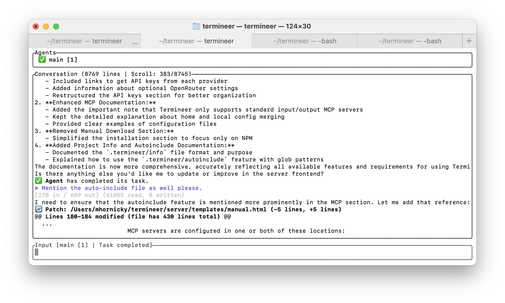

# Termineer: Advanced AI Terminal Assistant

A sophisticated command-line interface that integrates state-of-the-art AI models directly into the terminal, featuring self-directed agents, multi-agent coordination, and a unified tool framework across multiple LLM providers.

## Project Highlights

- Built with **Rust** for high performance and memory safety
- Implements **self-directed agents** capable of autonomous task decomposition and execution
- Features **multi-agent architecture** with specialized agents for different domains
- Provides **generic tool abstraction** that works seamlessly across Anthropic, Google, and OpenAI models
- Supports **Model Context Protocol (MCP)** for extensible tool integration
- Includes sophisticated **TUI (Terminal User Interface)** with real-time updates and rich formatting

## Key Innovations

This project explores several cutting-edge concepts in AI-assisted development:

- **Self-Directed Agents**: Agents that can autonomously break down complex tasks, make decisions, and execute multi-step workflows without constant human intervention
- **Multi-Agent Communication**: Sophisticated coordination between specialized agents, enabling complex task decomposition and parallel execution
- **Generic Tool Implementation**: A unified interface for tools that works seamlessly across different LLM providers (Anthropic, Google, OpenAI via OpenRouter)
- **Model Context Protocol (MCP)**: Support for extending agent capabilities through standardized tool protocols
- **Intelligent Task Management**: LLM-powered decision making for task prioritization and interruption handling

## Screenshot



## Features

- **Interactive AI in Your Terminal**: Have multi-turn conversations with AI assistants directly in your command line
- **Multi-Model Support**: Connect to Anthropic Claude, Google Gemini, and OpenRouter models
- **Powerful Tooling**: Execute commands, manipulate files, fetch web content, and more through natural language
- **Rich Terminal UI**: Sophisticated terminal interface with conversation history and tool output display
- **Subscription Tiers**: Free/Plus/Pro modes with different feature sets and model access

## Requirements

- Rust (latest stable version recommended)
- Anthropic API key (for Claude models)
- Google API key (for Gemini models)
- OpenRouter API key (optional, for access to various models through OpenRouter)

## Architecture

- **Core Application**: Main program logic, configuration, and sophisticated TUI (Terminal User Interface)
- **Agent System**: Self-directed agent implementation with conversation management and multi-agent coordination
- **Tools Framework**: Generic tool implementation that works across all LLM providers
- **LLM Integration**: Unified interface for Anthropic, Google, OpenAI (via OpenRouter), and other providers
- **Model Context Protocol (MCP)**: Extensible tool system via standardized protocols
- **Authentication**: OAuth-based authentication with subscription tiers
- **Server Component**: Backend for authentication, subscriptions, and API services

## Installation

```bash
# Clone the repository
git clone https://github.com/semtexzv/termineer.git
cd termineer

# Build the project
cargo build --release

# Set up API keys (choose one method):
# Option 1: Create .env file
echo "ANTHROPIC_API_KEY=your_key_here" > .env

# Option 2: Export environment variable
export ANTHROPIC_API_KEY=your_key_here
```

## Quick Start

```bash
# Interactive mode
cargo run --release

# Single query mode
cargo run --release -- "Explain the code in main.rs"

# With specific model
cargo run --release -- --model claude-3-haiku-20240307 "What files are in src/?"

# With system prompt
cargo run --release -- --system "You are a code reviewer" "Review this function"
```

### Command-Line Options

- `--model MODEL_NAME` - Specify the AI model to use
- `--system PROMPT` - Set a system prompt
- `--help` - Display help message

### Interactive Commands

- `/help` - Display available commands
- `/clear` - Clear conversation history  
- `/system TEXT` - Set system prompt
- `/model NAME` - Change model
- `/exit` - Exit the program

### Environment Configuration

The application loads configuration from `.env` files in these locations:
1. Project root directory
2. `./env/.env`
3. `../.env` 
4. `~/.env`

Example `.env` file:
```
ANTHROPIC_API_KEY=your_anthropic_api_key
GOOGLE_API_KEY=your_google_api_key
OPENROUTER_API_KEY=your_openrouter_api_key
```

## Available AI Models

### Anthropic Claude Models
- `claude-3-opus-20240229` - Most capable Claude model (default)
- `claude-3-sonnet-20240229` - Balanced Claude model
- `claude-3-haiku-20240307` - Fastest Claude model
- `claude-3-7-sonnet-20250219` - Latest Claude 3.7 model

### Google Gemini Models
- `gemini-1.5-flash` - Fast Gemini model
- `gemini-1.5-pro` - Capable Gemini model
- `gemini-pro` - Previous generation Gemini model

### OpenRouter Models
- Various models available through OpenRouter API including GPT-4, Claude, and others

## Advanced Features

### MCP (Model Context Protocol) Integration

Termineer supports the Model Context Protocol for enhanced tool capabilities. MCP servers are configured using a `.term/config.json` file in your project directory:

```json
{
  "mcpServers": {
    "filesystem": {
      "command": "npx",
      "args": [
        "-y",
        "@modelcontextprotocol/server-filesystem",
        "/Users/username/Desktop",
        "/Users/username/Downloads"
      ]
    }
  }
}
```

This configuration is loaded automatically on startup, and the configured MCP servers are made available to the AI agents.

### Auto-Include Feature

Termineer can automatically include files in the conversation context at startup. Create a `.termineer/autoinclude` file in your project root with glob patterns (one per line):

```
# Example .termineer/autoinclude file
src/**/*.rs
*.toml
README.md
# Comments are supported with #
```

The agent will automatically load all matching files when it starts, making them available in the conversation context. This is useful for providing context about your project structure without manually including files.

### Custom Prompts and Workflows

- Configure agent behavior with Handlebars templates in the `prompts/` directory
- Define complex multi-step workflows for automation
- Create specialized agents for different domains (researcher, troubleshooter, orchestrator)


## Use Cases

- **Software Development**: Generate code, debug issues, create prototypes, automate tasks
- **Data Analysis**: Create analysis scripts, find patterns, optimize queries
- **System Administration**: Generate shell commands, create maintenance scripts, debug configurations
- **Research & Documentation**: Summarize content, research topics, generate documentation


## Technologies Used

- **Rust**: Core application built with Rust for performance and reliability
- **Tokio**: Asynchronous runtime for concurrent operations
- **Ratatui**: Terminal UI framework for rich interface
- **Handlebars**: Template system for prompt engineering
- **MCP Protocol**: For extensible tool integration
- **OAuth 2.0**: Secure authentication system

## License

MIT

